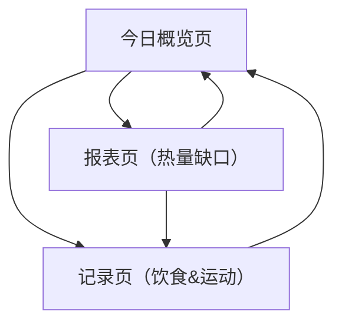

## 1. Product Overview
fit flow：用“拍照识别饮食 + 记录运动 + 自动算热量缺口”帮助你持续管理体重目标。
面向希望更省事、更可量化地进行饮食与运动管理的个人用户。

## 2. Core Features

### 2.1 Feature Module
我们的需求由以下核心页面构成：
1. **今日概览页**：当日摄入/消耗/缺口总览、快捷入口、最近记录。
2. **记录页（饮食&运动）**：饮食图片识别与编辑确认、运动记录与热量计算、记录列表管理。
3. **报表页（热量缺口）**：按天/周统计缺口、趋势与对比、可导出。

### 2.2 Page Details
| Page Name | Module Name | Feature description |
|-----------|-------------|---------------------|
| 今日概览页 | 今日关键指标卡片 | 展示当日“摄入 kcal / 运动消耗 kcal / 净摄入 kcal / 与目标差值（缺口或超额）”，支持切换日期（今天/昨天/自选）。 |
| 今日概览页 | 快捷操作入口 | 提供“拍照记饮食”“手动记饮食”“记录运动”按钮，进入记录页并自动聚焦对应表单。 |
| 今日概览页 | 最近记录摘要 | 展示当日最新饮食与运动记录列表（名称、时间、kcal），支持一键编辑/删除。 |
| 今日概览页 | 目标设置（内嵌） | 设置每日热量目标（kcal）；用于计算缺口与报表基准。 |
| 记录页（饮食&运动） | 饮食图片识别 | 上传/拍摄食物图片；调用识别服务返回“食物名称、估算份量、估算热量、置信度、候选项”；展示识别结果与图片预览。 |
| 记录页（饮食&运动） | 饮食确认与校正 | 支持编辑食物名称、选择候选项、调整份量（克/份）、调整热量（kcal）；保存为饮食记录并计入当日摄入。 |
| 记录页（饮食&运动） | 运动记录与热量计算 | 记录运动类型、时长、强度（可选）、体重（用于估算，若未填则沿用上次）；自动计算消耗热量并允许手动修正；保存为运动记录并计入当日消耗。 |
| 记录页（饮食&运动） | 记录列表管理 | 按日期查看饮食/运动记录；支持编辑、删除；变更后实时刷新当日汇总。 |
| 报表页（热量缺口） | 缺口汇总与图表 | 按天/周展示摄入、消耗、净摄入与缺口；支持时间范围筛选（最近7天/30天/自选）。 |
| 报表页（热量缺口） | 明细钻取 | 点击某一天进入当日明细（饮食/运动列表）并支持跳转到记录页继续编辑。 |
| 报表页（热量缺口） | 导出 | 导出当前时间范围的 CSV（日期、摄入、消耗、净摄入、目标、缺口）。 |

## 3. Core Process
**日常记录流（你）**
1) 进入今日概览查看当日摄入/消耗/缺口。
2) 选择“拍照记饮食”，上传图片并获得识别结果。
3) 在确认页校正食物与份量，保存饮食记录。
4) 选择“记录运动”，填写运动类型与时长，确认系统计算的消耗热量并保存。
5) 返回今日概览，指标与最近记录自动更新。

**复盘与报表流（你）**
1) 打开报表页，选择时间范围（7天/30天/自选）。
2) 查看缺口趋势与汇总；点击某天进入明细钻取。
3) 若发现记录不准，跳转到记录页修改；回到报表页查看更新后的结果。
4) 需要留存时导出 CSV。

