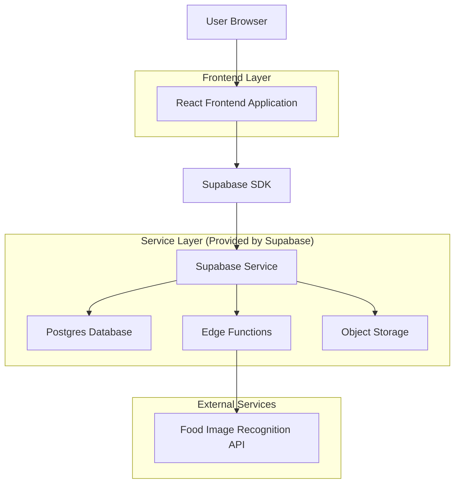
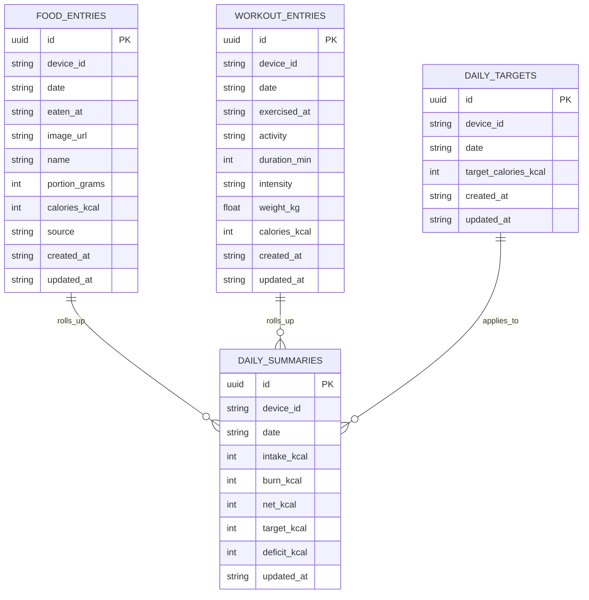

## 1.Architecture design


## 2.Technology Description
- Frontend: React@18 + TypeScript + vite + tailwindcss@3
- Backend: Supabase（PostgreSQL + Edge Functions + Storage）

## 3.Route definitions
| Route | Purpose |
|-------|---------|
| / | 今日概览：当日摄入/消耗/缺口与快捷入口 |
| /log | 记录页：饮食图像识别、饮食确认校正、运动记录与热量计算 |
| /reports | 报表页：热量缺口趋势、钻取与导出 |

## 4.API definitions (If it includes backend services)
### 4.1 Shared TypeScript types
```ts
export type DateISO = string; // YYYY-MM-DD

export type FoodRecognitionCandidate = {
  name: string;
  caloriesKcal: number;
  portionText?: string; // e.g. "100g" / "1 serving"
  confidence?: number; // 0-1
};

export type FoodEntry = {
  id: string;
  deviceId: string;
  eatenAt: string; // ISO datetime
  date: DateISO;
  imageUrl?: string;
  name: string;
  portionGrams?: number;
  caloriesKcal: number;
  source: "image" | "manual";
  createdAt: string;
  updatedAt: string;
};

export type WorkoutEntry = {
  id: string;
  deviceId: string;
  exercisedAt: string; // ISO datetime
  date: DateISO;
  activity: string;
  durationMin: number;
  intensity?: "low" | "medium" | "high";
  weightKg?: number;
  caloriesKcal: number;
  createdAt: string;
  updatedAt: string;
};

export type DailyTarget = {
  deviceId: string;
  date: DateISO;
  targetCaloriesKcal: number;
};

export type DailySummary = {
  deviceId: string;
  date: DateISO;
  intakeKcal: number;
  burnKcal: number;
  netKcal: number; // intake - burn
  targetKcal: number;
  deficitKcal: number; // target - net
};
```

### 4.2 Edge Function: Food image recognition
```
POST /functions/v1/food-recognize
```
Request (multipart/form-data):
| Param Name| Param Type | isRequired | Description |
|----------|------------|------------|-------------|
| image | file | true | 食物图片 |
| locale | string | false | 语言偏好（默认 zh） |

Response:
| Param Name| Param Type | Description |
|----------|------------|-------------|
| candidates | FoodRecognitionCandidate[] | 候选识别结果列表（按置信度排序） |
| imageUrl | string | 已上传到 Storage 的图片 URL |

Example response:
```json
{
  "imageUrl": "https://<project>.supabase.co/storage/v1/object/public/food-images/xxx.jpg",
  "candidates": [
    {"name":"鸡胸肉","caloriesKcal":165,"portionText":"100g","confidence":0.74},
    {"name":"烤鸡腿","caloriesKcal":215,"portionText":"100g","confidence":0.41}
  ]
}
```

## 6.Data model(if applicable)
### 6.1 Data model definition


### 6.2 Data Definition Language
Food entries (food_entries)
```
CREATE TABLE food_entries (
  id UUID PRIMARY KEY DEFAULT gen_random_uuid(),
  device_id TEXT NOT NULL,
  date TEXT NOT NULL,
  eaten_at TIMESTAMPTZ NOT NULL,
  image_url TEXT,
  name TEXT NOT NULL,
  portion_grams INTEGER,
  calories_kcal INTEGER NOT NULL,
  source TEXT NOT NULL CHECK (source IN ('image','manual')),
  created_at TIMESTAMPTZ DEFAULT NOW(),
  updated_at TIMESTAMPTZ DEFAULT NOW()
);
CREATE INDEX idx_food_entries_device_date ON food_entries(device_id, date);

GRANT SELECT ON food_entries TO anon;
GRANT ALL PRIVILEGES ON food_entries TO authenticated;
```

Workout entries (workout_entries)
```
CREATE TABLE workout_entries (
  id UUID PRIMARY KEY DEFAULT gen_random_uuid(),
  device_id TEXT NOT NULL,
  date TEXT NOT NULL,
  exercised_at TIMESTAMPTZ NOT NULL,
  activity TEXT NOT NULL,
  duration_min INTEGER NOT NULL,
  intensity TEXT CHECK (intensity IN ('low','medium','high')),
  weight_kg REAL,
  calories_kcal INTEGER NOT NULL,
  created_at TIMESTAMPTZ DEFAULT NOW(),
  updated_at TIMESTAMPTZ DEFAULT NOW()
);
CREATE INDEX idx_workout_entries_device_date ON workout_entries(device_id, date);

GRANT SELECT ON workout_entries TO anon;
GRANT ALL PRIVILEGES ON workout_entries TO authenticated;
```

Daily targets (daily_targets)
```
CREATE TABLE daily_targets (
  id UUID PRIMARY KEY DEFAULT gen_random_uuid(),
  device_id TEXT NOT NULL,
  date TEXT NOT NULL,
  target_calories_kcal INTEGER NOT NULL,
  created_at TIMESTAMPTZ DEFAULT NOW(),
  updated_at TIMESTAMPTZ DEFAULT NOW(),
  UNIQUE(device_id, date)
);
CREATE INDEX idx_daily_targets_device_date ON daily_targets(device_id, date);

GRANT SELECT ON daily_targets TO anon;
GRANT ALL PRIVILEGES ON daily_targets TO authenticated;
```

Daily summaries (daily_summaries)
```
CREATE TABLE daily_summaries (
  id UUID PRIMARY KEY DEFAULT gen_random_uuid(),
  device_id TEXT NOT NULL,
  date TEXT NOT NULL,
  intake_kcal INTEGER NOT NULL DEFAULT 0,
  burn_kcal INTEGER NOT NULL DEFAULT 0,
  net_kcal INTEGER NOT NULL DEFAULT 0,
  target_kcal INTEGER NOT NULL DEFAULT 0,
  deficit_kcal INTEGER NOT NULL DEFAULT 0,
  updated_at TIMESTAMPTZ DEFAULT NOW(),
  UNIQUE(device_id, date)
);
CREATE INDEX idx_daily_summaries_device_date ON daily_summaries(device_id, date);

GRANT SELECT ON daily_summaries TO anon;
GRANT ALL PRIVILEGES ON daily_summaries TO authenticated;
```
